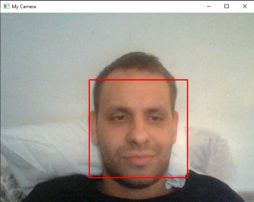
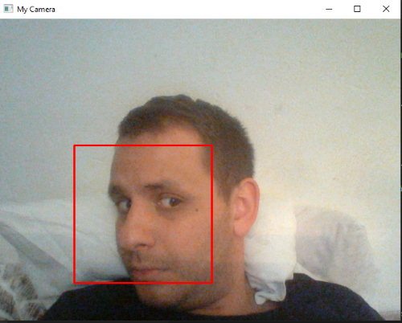

# Facial Recognition

*Facial recognition app written in Python.*


## Application Desing

### *Camera Window*


Camera window with face selected in first position.

### *Camera Window*


Camera window with face selected in second position.


## Other remarks

### How to start the project

- Install python
- run ```pip install opencv-python``` to install the open-cv dependency
- start the app through Visual Studio Core or some other IDE